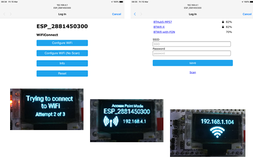

# WiFiConnect 
WiFi Manager for ESP8266 and ESP32 chips with support for OLED 128x64 screens

# Overview
This is a wifi manager based upon the popular [WiFi Manager](https://github.com/tzapu/WiFiManager) .
I created this project as I was finding that wifi managers were not fully supporting my needs or the ESP32 and I has just bought a Heltec ESP32 WiFi kit with onboard OLED display, I decided to extend and modify WiFiManager to my needs.

WiFiConnect can be used when no screen is needed and WiFiConnectOLED for feedback to the user via an OLED display.

I'm using a customised font definition Roboto_Font.h that was generated with the help of the online tool [http://oleddisplay.squix.ch/]( http://oleddisplay.squix.ch/)
I have also customised a version of ESP8266_SSD1306 version 4, available [here](https://github.com/smurf0969/esp8266-oled-ssd1306/tree/Allow-overriding-default-font) to use my Roboto font by default and prevent the default font from being loaded into memory.
If you decide to use the origional library, please remove #define OLEDDISPLAYFONTS_h from the Robotto font file.
The origional version is available at [ESP8266_SSD1306](https://github.com/squix78/esp8266-oled-ssd1306.git)

# Documentation

Further documentation can be found at [https://smurf0969.github.io/WiFiConnect/](https://smurf0969.github.io/WiFiConnect/)

# Screenshots

# IDE & Library Versions
### Arduino IDE
  - Arduino: 1.8.8

### Hardware Package Core Libraries
  - esp32 1.0.1
    - FS 1.0
    - SPIFFS 1.0
    - Wire 1.0.1
  - ESP8266 Core 2.5.0-dev [https://github.com/esp8266/Arduino](https://github.com/esp8266/Arduino)
    - Wire 1.0
### Libraries
  - ArduinoJson 6.9.1 [https://github.com/bblanchon/ArduinoJson.git](https://github.com/bblanchon/ArduinoJson.git) or [https://blog.benoitblanchon.fr](https://blog.benoitblanchon.fr)

## Thanks
Many thanks to the authors and contibutors for the main libraries that made this project possible or those that made my modifications possible 
* [ESP8266_SSD1306](https://github.com/squix78/esp8266-oled-ssd1306.git) for using a OLED Display
* [http://oleddisplay.squix.ch/]( http://oleddisplay.squix.ch/) for generating font definitions
* [WiFiManager](https://github.com/tzapu/WiFiManager) for the basis for this project
* [ArduinoJson](https://github.com/bblanchon/ArduinoJson) for saving configuration parameters

Stuart Blair (smurf0969)
